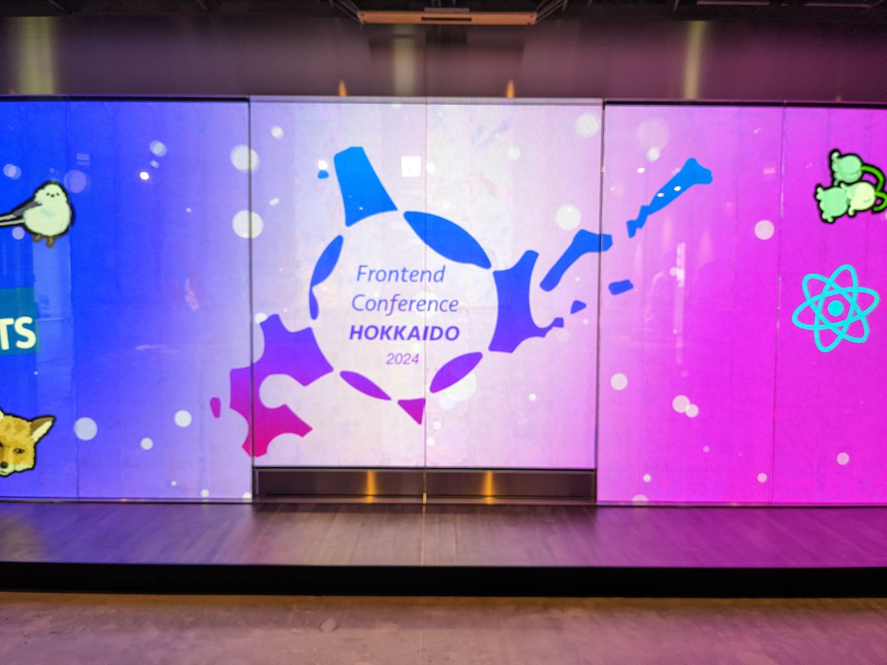
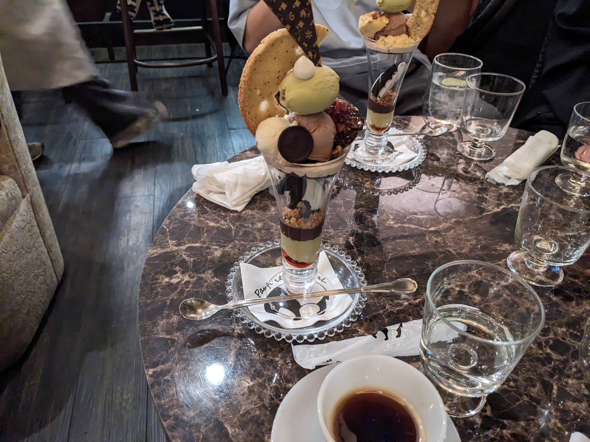
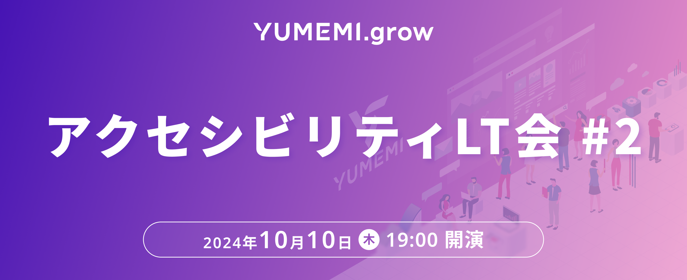
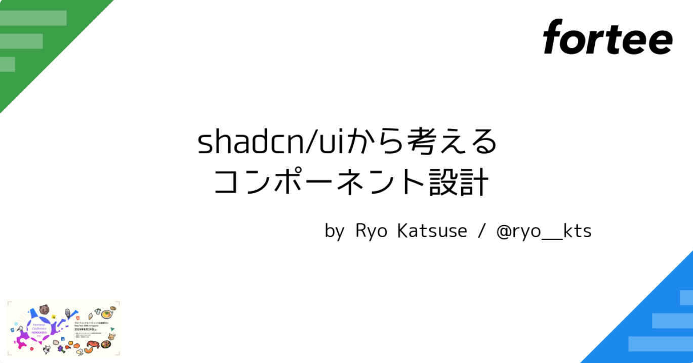
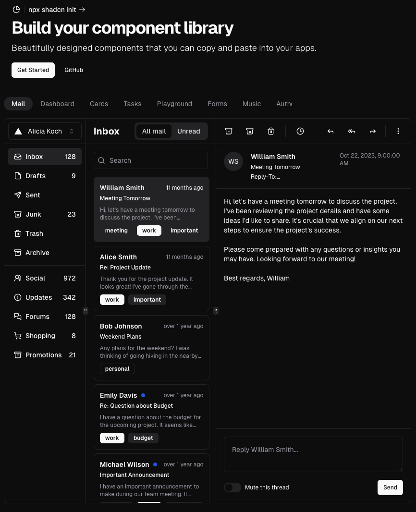
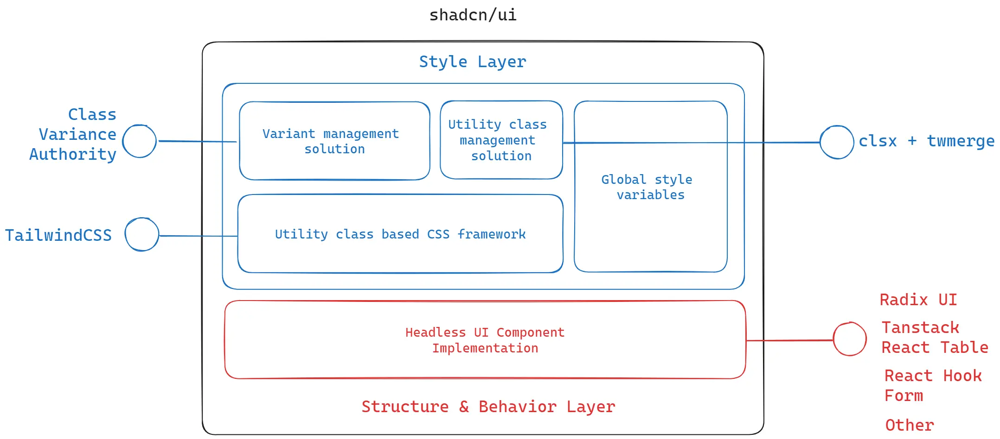

---
# You can also start simply with 'default'
theme: default
# random image from a curated Unsplash collection by Anthony
# like them? see https://unsplash.com/collections/94734566/slidev
background: false
# some information about your slides (markdown enabled)
title: shadcn/uiで考えるコンポーネント設計
# apply unocss classes to the current slide
class: text-center
# https://sli.dev/features/drawing
drawings:
  persist: false
# slide transition: https://sli.dev/guide/animations.html#slide-transitions
transition: slide-left
# enable MDC Syntax: https://sli.dev/features/mdc
mdc: true
---

# shadcn/uiで考えるコンポーネント設計

ゆめみ×LayerX×サイボウズ3社合同フロントエンドカンファレンス北海道2024後夜祭＠東京
2024/09/06
<!--
<div class="pt-12">
  <span @click="$slidev.nav.next" class="px-2 py-1 rounded cursor-pointer" hover="bg-white bg-opacity-10">
    Press Space for next page <carbon:arrow-right class="inline"/>
  </span>
</div> -->

<div class="abs-br m-6 flex gap-2">
  <button @click="$slidev.nav.openInEditor()" title="Open in Editor" class="text-xl slidev-icon-btn opacity-50 !border-none !hover:text-white">
    <carbon:edit />
  </button>
  <a href="https://github.com/slidevjs/slidev" target="_blank" alt="GitHub" title="Open in GitHub"
    class="text-xl slidev-icon-btn opacity-50 !border-none !hover:text-white">
    <carbon-logo-github />
  </a>
</div>

<!--
The last comment block of each slide will be treated as slide notes. It will be visible and editable in Presenter Mode along with the slide. [Read more in the docs](https://sli.dev/guide/syntax.html#notes)
-->

---
layout: two-cols
---


# About

- Infixer(Ryo Katsuse)
- 株式会社ゆめみ
- フロントエンドエンジニア
- 放送大学3年生
- アウトプット
  - [X](https://x.com/ryo__kts)（Twitter）
  - [Cosense（旧scrapbox）](https://scrapbox.io/ryokatsu/)
  - [ブログ](https://www.ryokatsu.dev/)
  - [GitHub](https://github.com/ryokatsuse)
- 北海道で食べた美味しかったもの
  - ジンギスカン、〆パフェ

::right::

<div>
  
  <div class="flex justify-center gap-5 flex-wrap">
<div>
  

</div>
<div>
  

</div>
<div>
  

</div>
<div>
  

</div>
  </div>
</div>

---
transition: slide-left
---

## ちょっと宣伝

アクセシビリティLT会 #2をLINEヤフーさまと共催で大阪にて行います！




開催：2024/10/10 (木):LINEヤフー株式会社 大阪グランフロントオフィス（オンラインでも配信！）

YUMEMI.growの[Compassページ](https://connpass.com/user/yumemi/open/)にて近日公開！

前回のアクセシビリティLT会の[内容](https://yumemi.connpass.com/event/323801/)


---
transition: slide-left
layout: two-cols
---

# お品書き

- shadcn/uiとは
  - コンポーネントの思想
- cvaを用いた設計
- formコンポーネントについて
- 案件でつかったみた感想
- まとめ

本日は、採択されなかったプロポーザル（LT5分枠）についてお話します！

shadcn/uiの話をしますが、最近はReact Ariaにハマっています。。。！

::right::



---
layout: center
transition: slide-left
---

# shadcn/uiとは

---
layout: two-cols
transition: slide-left
---

# shadcn/uiとは

- インストール不要で、ソースコードをコピペだけで使用できるコンポーネント集
- コンポーネントを好きなようにカスタマイズ可能
- 依存関係を気にせず好きなコンポーネントを好きな分だけ導入可能
- [v0](https://v0.dev/)で吐き出されるコードはshadcn/uiベースのもの


v0に[カンファレンスのタイムテーブル](https://v0.dev/chat/ufwOc5N02HK)的なものを作らせてみた！

<small><a href="https://ui.shadcn.com/">shadcn/ui公式サイト</a> </small>

::right::




---

# 実際にプロジェクトで導入してみた

- 小-中規模の決済システムのようなアプリケーション
- システムの構成上凝ったデザインがなくシンプルなUI
- Next.jsのPage Routerでの開発
- 開発期間が短い
  - コンポーネント開発に時間を割けない

上記を踏まえた上で、プリミティブなコンポーネントがまとまったshadcn/uiを採用✌

- ~~PandaCSS🐼~~
  - shadcn/ui以外の個別のレイアウトなどを実装する際に採用したが、オーバーヘッドがあったり、TailwindCSSの世界線で収まると判断したため早い段階でやめた

shadcn/uiは、プリミティブでシンプルなコンポーネントが揃っているので、大規模で複合的なコンポーネントや、コンポーネントの数が多いようなアプリケーションでは向いていないかもしれない

[Mantine](https://mantine.dev/)など最初からコンポーネントが豊富なものが良さそう


---
layout: center
transition: slide-left
---

# shadcn/uiの思想 構造とスタイルの分離

---
layout: two-cols
transition: slide-left
---

# 構造

- ヘッドレスUI
  - RadixUIをベースにアクセシビリティ対応だったりインタラクションの部分を提供している
  - DatePickerは[React DayPicker](https://daypicker.dev/)を使っている
  - フォームにはついては[React Hook Form](https://react-hook-form.com/)
  - テーブルについては[TanStack Table](https://tanstack.com/table/latest)など

<small><a href="https://manupa.dev/blog/anatomy-of-shadcn-ui">The anatomy of shadcn/ui</a> </small>

::right::




---
layout: two-cols
transition: slide-left
---

# スタイル

  - コアな部分のCSSがTailwindCSS
  - class文字列の連結など、ユーティリティな管理にはtwMergeとclsx
  - グローバルなスタイルはTailwind.config
  - 各種のVariant管理にはCVAを使用（後述します）

  <small><a href="https://manupa.dev/blog/anatomy-of-shadcn-ui">The anatomy of shadcn/ui</a> </small>

::right::


---


## なぜこうなっているのか？🤔

[Introduction](https://ui.shadcn.com/docs)に記述がある

<br>

> Why copy/paste and not packaged as a dependency?

<br>

> The idea behind this is to give you ownership and control over the code, allowing you to decide how the components are built and styled. Start with some sensible defaults, then customize the components to your needs. One of the drawbacks of packaging the components in an npm package is that the style is coupled with the implementation. The design of your components should be separate from their implementation.

コードの所有権と制御を与えます！

コンポーネントの構築方法とスタイルを決定できるようにすることが重要と考えています。

<span v-mark="{ at: 1, color: 'red'}">
パッケージの欠点の1つはパッケージ化すると、スタイルと実装が密結合なっている。
</span>


コンポーネントのデザインは実装と切り離すべき！！

---
layout: center
transition: slide-left
---

# CVAについて

---

# CVAとは

- プライマリー、セカンダリーボタンのようなコンポーネントを実装するとき
  - classnamesやclsxなどを使って条件分岐によってスタイルを切り替える
  - そもそもコンポーネントを分割してしまう
  - 大量のpropsがあると何を渡せばいいかわからなくなる。。。
- そんな悩みを解決してくれるのがCVA！
- 最終的に出力されるCSSがどのような状態のスタイルなのかが構造化されているので見やすい
- [FigmaのVariants](https://help.figma.com/hc/ja/articles/360056440594-%E3%83%90%E3%83%AA%E3%82%A2%E3%83%B3%E3%83%88%E3%81%AE%E4%BD%9C%E6%88%90%E3%81%A8%E4%BD%BF%E7%94%A8)の概念をそのままコードに落とし込めるようなイメージ

<br>

ちなみに、TailwindCSSの場合は、cvaより拡張性の高い[Tailwind Variants](https://www.tailwind-variants.org/)があります🙌

---

## こういうやつ


``` tsx

const buttonVariants = cva(
  "inline-flex items-center justify-center whitespace-nowrap rounded-md text-sm font-medium ring-offset-background transition-colors focus-visible:outline-none focus-visible:ring-2 focus-visible:ring-ring focus-visible:ring-offset-2 disabled:pointer-events-none disabled:opacity-50",
  {
    variants: {
      variant: {
        default: "bg-primary text-primary-foreground hover:bg-primary/90",
        secondary: "bg-secondary text-secondary-foreground hover:bg-secondary/80",
      },
      size: {
        default: "h-10 px-4 py-2",
        sm: "h-9 rounded-md px-3",
        lg: "h-11 rounded-md px-8",
        icon: "h-10 w-10",
      },
    },
    defaultVariants: {
      variant: "default",
      size: "default",
    },
  }
)
```

---

# Buttonコンポーネントの構造

```tsx
export interface ButtonProps
  extends React.ButtonHTMLAttributes<HTMLButtonElement>,
    VariantProps<typeof buttonVariants> {
  asChild?: boolean
}
 
const Button = React.forwardRef<HTMLButtonElement, ButtonProps>(
  ({ className, variant, size, asChild = false, ...props }, ref) => {
    const Comp = asChild ? Slot : "button"
    return (
      <Comp
        className={cn(buttonVariants({ variant, size, className }))}
        ref={ref}
        {...props}
      />
    )
  }
)
Button.displayName = "Button"
 
export { Button, buttonVariants }

```


---

# Dialogコンポーネント

- それぞれのパーツを組み合わせて使うようになっている

``` tsx
<Dialog>
  <DialogTrigger asChild>
    <Button variant="primary">open</Button>
  </DialogTrigger>
  <DialogHeader>ヘッダー</DialogContent>
  <DialogContent className="flex flex-col">
    <p>コンテンツ</p>
  </DialogContent>
  <DialogFooter>フッター</DialogFooter>
</Dialog>

// 使用例
<Dialog
  triggerButton={<Button variant="primary" onClick={dialogOpen}>open</Button>}
  header='ヘッダー'
  content={<p>コンテンツ</p>}
  footer='フッター'
/>
```

---
layout: center
transition: slide-left
---

# Formコンポーネント


---
layout: two-cols
---

# Formコンポーネント

- shadcn/uiにはFormコンポーネントがある
- 内部的にReact Hook Formを使っている
- 実際のプロジェクトでもFormコンポーネントを使った。
- 普段からReact Hook Formを使っていればそこまでハマることはない。（多分...）

::right::

``` tsx
<Form {...form}>
  <form className="w-60 px-2" onSubmit={handleSubmit(onSubmit)}>
    <FormField
      control={form.control}
      name="label"
      render={({ field: { value, onChange } }) => (
        <FormItem>
          <FormLabel>ラベル</FormLabel>
          <FormControl>
            <NumberInput
              value={value}
              onValueChange={(value) => {
                onChange(value.value);
              }}
              isError={isDefined(form.formState.errors.label)}
            />
          </FormControl>
          <FormMessage />
        </FormItem>
      )}
    />
    <p>Current value is: {form.watch('label')}</p>
    <Button type="submit" className="mt-4">
      Submit
    </Button>
  </form>
</Form>
```

---

# しかしReact Hook Formは使いたくない！

- React Hook Formは、ドキュメントが分かりにくい！！！（個人の主観）
- React Server Componentの登場によって雲行きが怪しくなっている。
- なんかいいライブラリがないかなー
- [Conform](https://conform.guide/)といライブラリがあるみたいだよ
- シンプルだし、機能的にも良さそう！
- ***shadcn/uiはプリミティブなInputなどが揃っているので、Formコンポーネントだけネイティブのformに置き換えれば実装できる！！！！***

---
layout: center
transition: slide-left
---

# 案件でつかったみた感想

---
layout: two-cols
---

# 案件でつかったみた感想
- 実装するアプリケーションが凝ったデザインがシンプルで、コンポーネントの数も多くない場合は選択肢の一つ
- 実際にほとんどコピペだけの状態で構造は利用して、CSSはデザイントークン（色、タイポグラフィなど）の微修正だけでコンポーネントがすぐにできた
- フォームコンポーネントについては、特にハマることもなかった。
- shadcn/uiではない独自コンポーネントでもcvaを使ってCSSを管理したことで統一感が生まれた
- classNameを渡すことができてしまうので、ルールなどをチームと話し合うと良さそう

::right::

```tsx

const BlockVariants = cva('flex w-full items-center justify-between rounded-lg px-4 py-5', {
  variants: {
    bgColor: {
      primary: 'bg-main-primary-dark',
      error: 'bg-unique-error',
      disabled: 'bg-text-disable',
    },
  },
});

const Block: FC<BlockProps> = ({ variant, amount }) => {
  return (
    <div className={BlockVariants({ bgColor: variant })}>
      <p className="text-large text-base-white">{TypeText[variant]}</p>
      <div className="text--block text-base-white">
        <div className="inline-block">
          <span>{numericFormatter(amount.toString(), { thousandSeparator: true })}</span>
          <span>円</span>
        </div>
        <p className="inline-block px-2 align-bottom text-small">テスト</p>
      </div>
    </div>
  );
};

export { Block };

```

---

# まとめ

- shadcn/uiはコンポーネントを、好きなだけ導入できるコンポーネント集
- 構造とスタイルのレイヤーに分離されていて、カスタマイズが自由にできるので柔軟に開発ができる！
- Variantはいいぞ！
- Formコンポーネントは使わなくても大丈夫！
